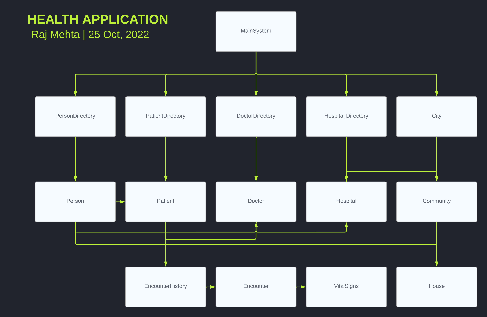
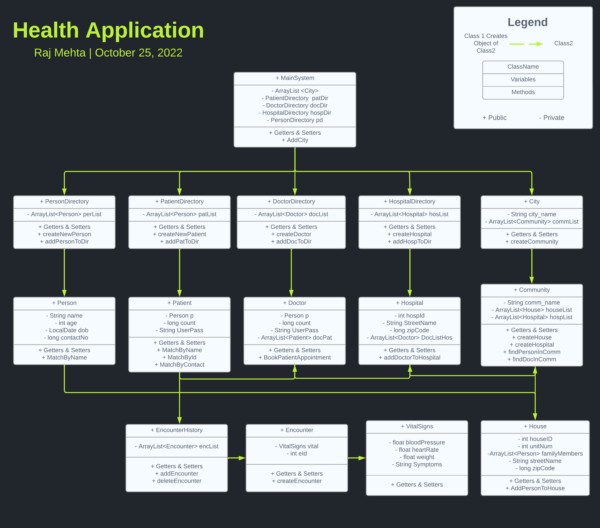

# Health Application
## RajMehta - 002743076

* Basic Decription - This repository contains a health application which can manage patients, doctors, hospitals, community, settees, encounters, etc. 

* Technical Description - In this Iteration I have used java Swing (https://docs.oracle.com/javase/tutorial/uiswing/) for the front-end of the application. There are total of 15 Java classes within the model package and seven UI classes within the UI package. This repository also contains Ikin package which consist of PNG image for icons. Other than that this application also has five different roles which can perform different task. The first being patient role who can find doctors within the community and book an appointment with a doctor. The second role being Doctor role where one can login and search for the patients and add/read encounters for patients. The patients can login and view their encounters. The third role as community admin, where one can add , update and read all the hospitals and houses within the community. One can also create a hospital or a new house and assign a person within the house and assign Doctor Vedanta Hospital. A fourth being Hospital admin where one can view all the hospitals within all the communities can create a new hospital, and can assign a particular Dr to a Hospital. The final role as system admin where one can perform create, read, update, delete and search operations on all the 14 classes, namely person, patient doctor, hospital house, community, city, percent directory, patient directory, Hospital directory, Doctor directory, vital signs encounters and encounter history. I have also implemented login for all these pages.

* Flow Chart - 

* Class Diagram - 

* Softwares Used -  Apache NetBeans IDE 15
* Java Version - Java HotSpot(TM) 64-Bit Server VM 16.0.2+7-67Java(TM) SE 
* Runtime - Runtime Environment 16.0.2+7-67
* OS - Mac OS X version 10.16 running on x86_64; UTF-8; en_GB (nb)
